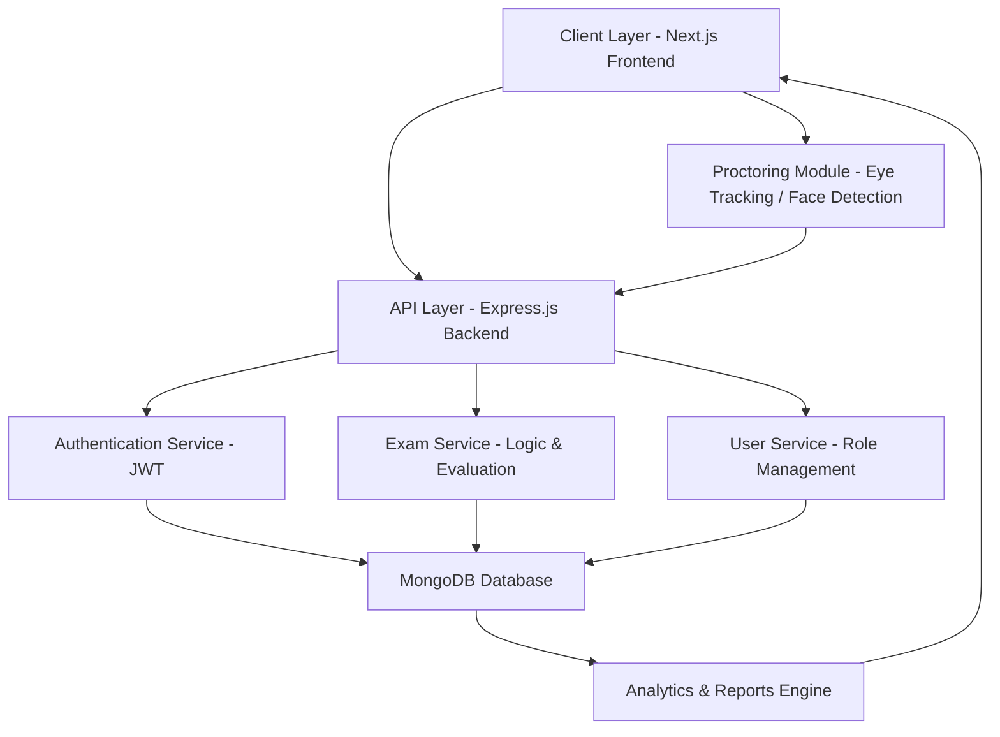
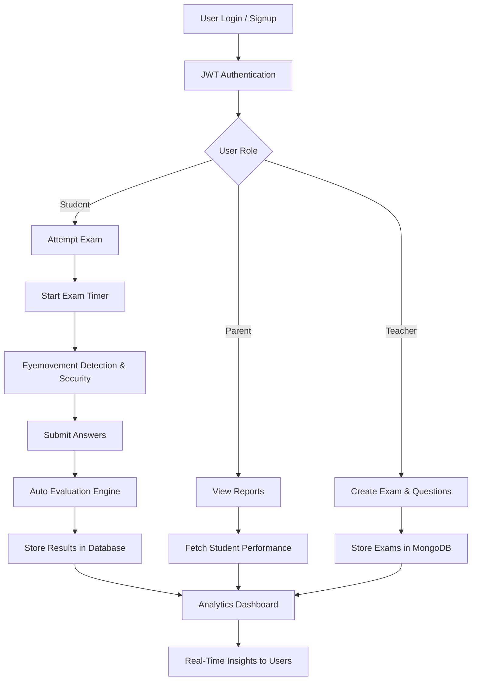

# 🧠 Online Examination System

A **secure, role-based online examination platform** designed to simulate real-world exam environments with **automated evaluation, analytics, and basic proctoring features**.

The system supports **students, teachers, parents, and admins**, reducing manual evaluation effort by **~80%** through automation.

---

## 🏗️ System Architecture & Design

### 🔹 High-Level Architecture

## 🔁 User Flow

## 🚀 Key Features

### 👩‍🏫 Teachers
- Create and manage exams  
- Configure time limits, marks, negative marking  
- Access analytics dashboard  

### 🧑‍🎓 Students
- Attempt mock and live exams  
- Instant feedback and score analysis  
- Performance history tracking  

### 👨‍👩‍👧 Parents
- Real-time performance monitoring  
- Exam alerts and summaries  

---

## 🔐 Security Features

- JWT-based authentication  
- Role-Based Access Control (RBAC)  
- Password hashing using bcrypt  
- Secure API handling with validation middleware  

---

## 🛠️ Tech Stack

| Layer | Technologies |
|------|-------------|
| Frontend | Next.js, Tailwind CSS |
| Backend | Node.js, Express.js |
| Database | MongoDB (Mongoose) |
| Auth | JWT, bcrypt |
| Deployment | Vercel, Render |

---

## 🧩 Core Modules

| Module | Description |
|--------|-------------|
| User Management | Multi-role authentication and dashboards |
| Exam Engine | Exam lifecycle, timer, submission |
| Evaluation Engine | Auto-grading and result calculation |
| Monitoring System | Basic cheating detection |
| Analytics | Performance insights and reports |

---

## 📈 Future Improvements

- AI-based proctoring (advanced gaze detection)  
- WebSocket-based real-time monitoring  
- Scalability improvements using caching (Redis)  
- Microservices-based architecture  

---

